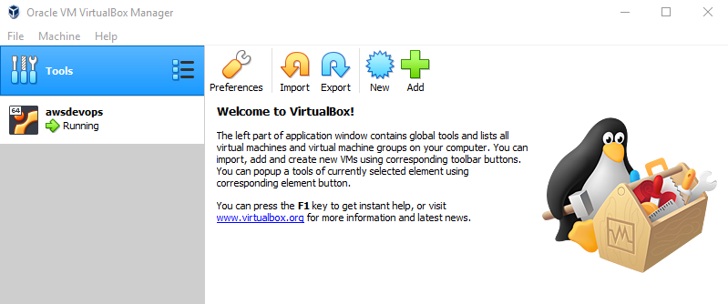

# AWS LAB DEVOPS
How to create infra in AWS with terraform and provision the created ec2 instance with ansible (by using command line and ssm)

Terraform will create:  
1 vpc  
1 internet gateway  
2 subnet (1 public and 1 private )  
2 routes (1 per subnet)  
1 security group (for ssh, http and https)  
1 nacl  
1 IAM role for ssm  

## Prerequisites
You need to have these programs in place:
-  [Vagrant](https://www.vagrantup.com/downloads.html): download the proper package for your operating system and architecture (Click on Windows 64-bit link). 
-  [VirtualBox](https://www.virtualbox.org/wiki/Downloads): by downloading, you agree to the terms and conditions of the respective license. (Click on Windows hosts link)  
- Be sure VT-x is enabled in your Bios.

**Note:**
- Follow default installation, by clicking on next, next, next, etc.
- After the software was installed, restart your computer. Once your system is back, open a command prompt and be sure that the following command is working: vagrant -v.

## FIRST STEP (creating ubuntu server that will be used to create the infra in aws and also to provision the software)

- Fork the repository
- Clone this repository
- goto folder aws_lab_devops
- run the follwing command: **vagrant up**
  
**FIGURE 3: You can check the progress also by opening Oracle VM Virtual Box Manager**
- once script is done, you can connect to the VM by using the following command: **vagrant ssh awsdevops**
- once logged in: configure your aws client by running: **aws configure**

## SECOND STEP
1) Clone this repository again in linux box.
2) Need to specify the Key Pair in file /terraform/app_name/prod if you want to connect to it.  
4) First create and pem in aws console and later download locally.  
5) copy the file to linux machine  

## CREATING INFRA

sudo bash
cd /
cd /aws_devops  
cp G1B4.pem /home/vagrant  
cd /home/vagrant
chmod 400 G1B4.pem

6) Test connectivity by ussing ssh type:  
ssh -i "G1B4.pem" ubuntu@ec2-34-207-172-223.compute-1.amazonaws.com

7) run the following command
cd /home/vagrant/aws_lab_devops
ansible-playbook -i aws_hosts.yml playbook-test.yml 

8) 

Falta crear un IAM para flowlogsrole y hacer que la vpc tengo flowlogrole por defecto

https://medium.com/chrisjerry/architect-using-terraform-dd1ae7da98f4
https://jee-appy.blogspot.com/2018/07/create-aws-infrastructure-with-terraform.html
https://medium.com/@brad.simonin/create-an-aws-vpc-and-subnet-using-terraform-d3bddcbbcb6

https://jee-appy.blogspot.com/2018/07/create-aws-infrastructure-with-terraform.html
